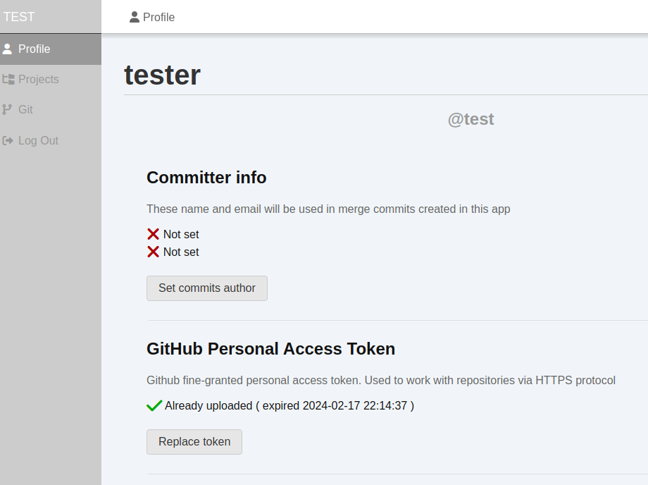

# Add GutHub token

This page describes how to add your Personal Access Token (PAT) from GitHub. 
You need to add PAT if you want work with private GitHub repositories.
PAT is not needed for local operations (like create packs, merge branches, or create checkpoints).

You can add it later if you just want to try `Release Builder` with public repositories and without any push operations.

## Create Personal Access Token

Please, read the GitHub page about tokens: 
[Managing your personal access tokens](https://docs.github.com/en/authentication/keeping-your-account-and-data-secure/managing-your-personal-access-tokens)

I recommend you to use **fine-grained tokens** because you can manage repositories that allowed to access with certain token 
(and you can update this list if you need). 
It is flexible, convenient way to manage access for your token.

After creating token on GitHub side, copy your token value and add it on `Profile` page of your `Release Builder` app.

1. Open `Profile` page and click on `Add token` button

2. Paste you personal token to text field and press `Check token` button. `Release Builder` will send a request to GitHub, get expiration date of token, and show it to you.

3. If all is good just save the token. Now you are ready to work with your remote repositories **which allowed for you PAT**!

