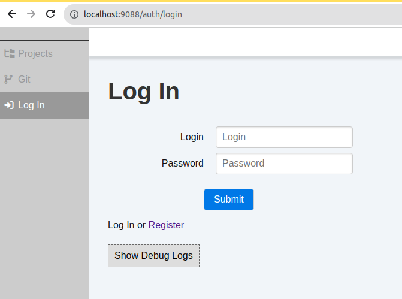
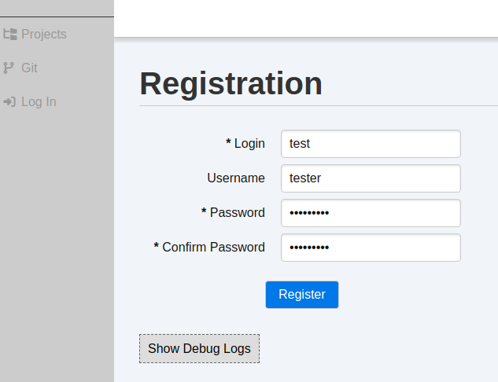
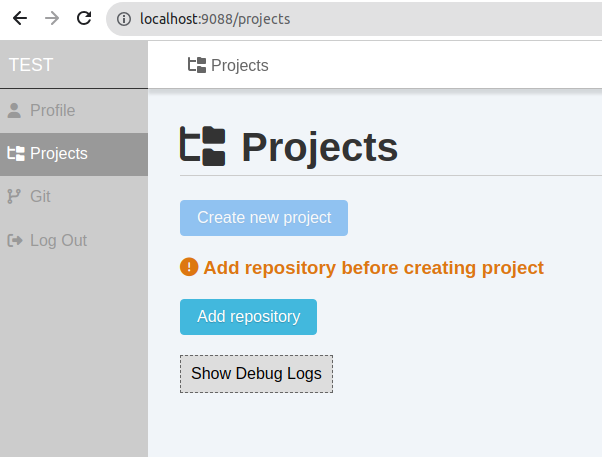
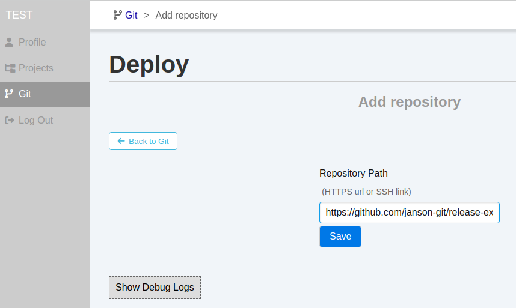
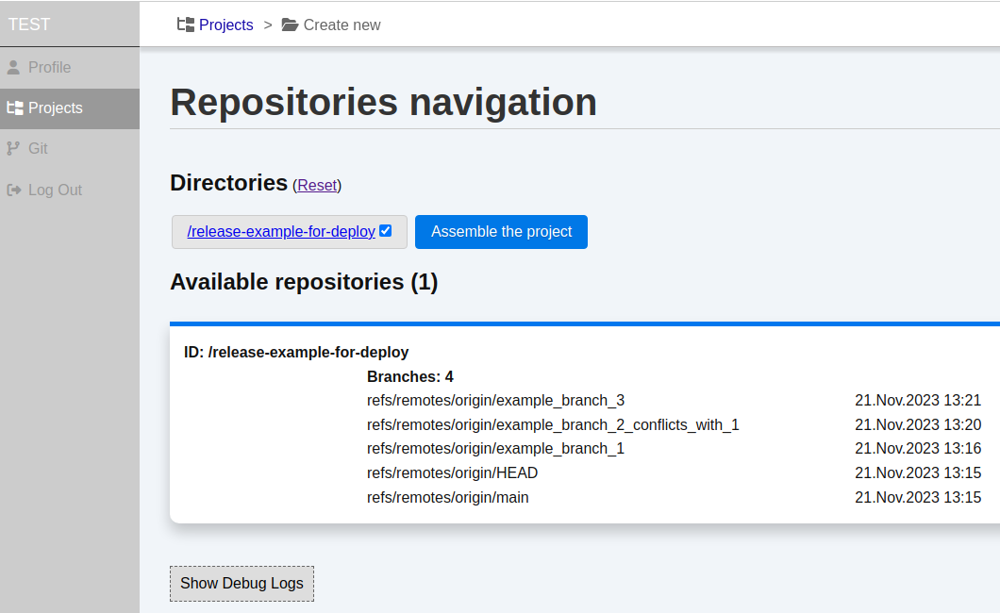
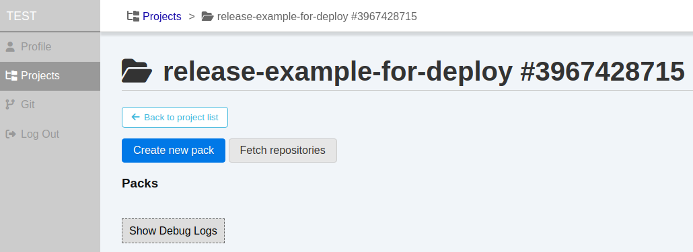
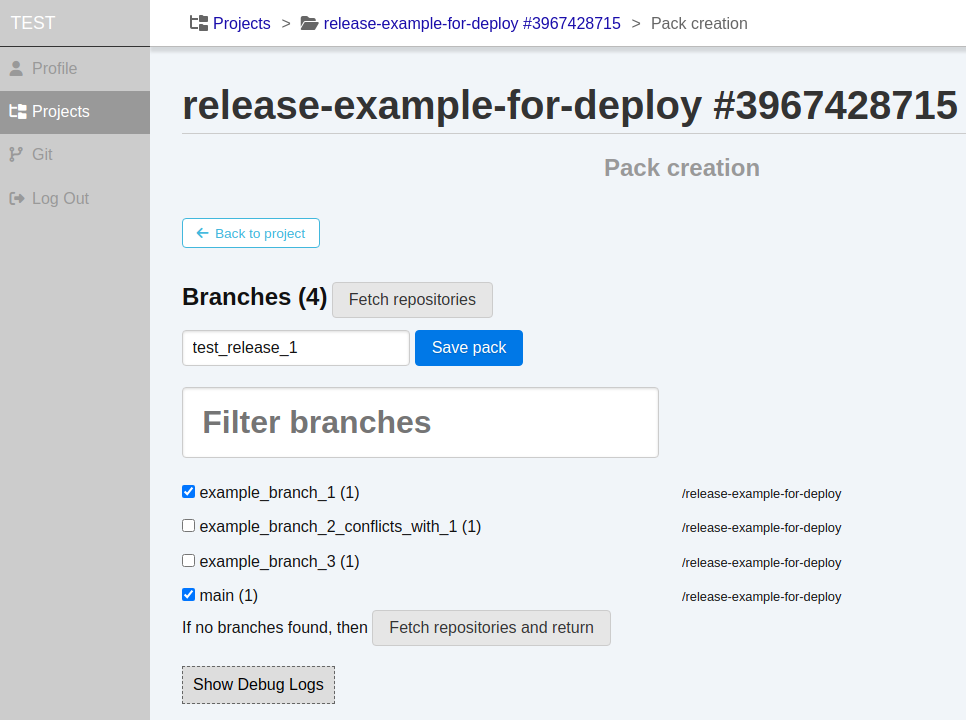
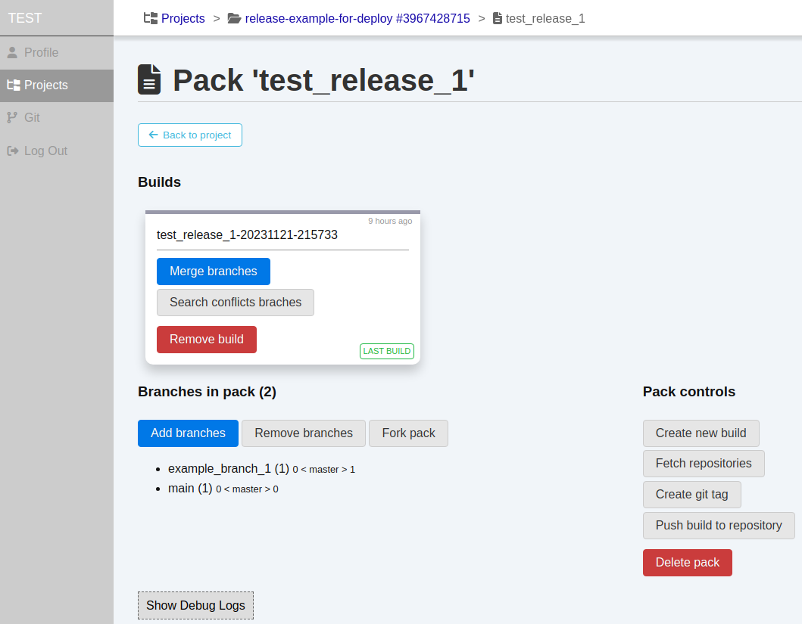
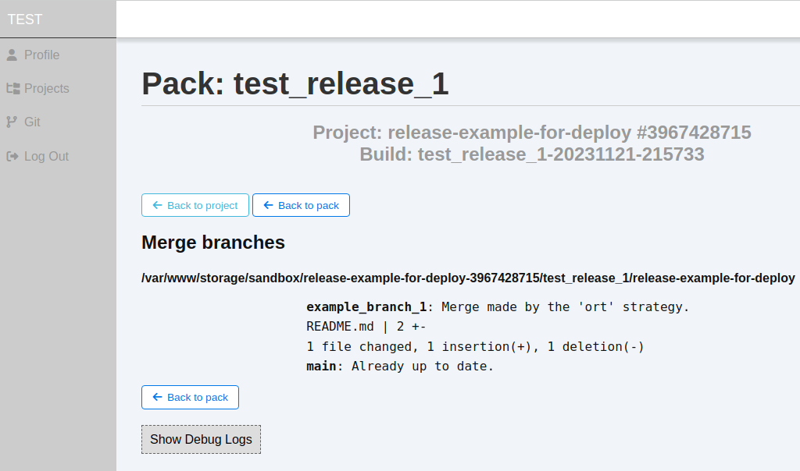

# Usage, example workflow

This document describes simple example of release branch creating. 
I recommend use one of public repositories to testing app.

This document use a public [repository](https://github.com/janson-git/release-example-for-deploy.git) that specially created for testing purposes.

Additionally, it maybe helpful to know [terms](./terms.md) that used in app.

### INSTALL (you need docker and docker-compose)

#### 1. Clone and install `release-builder` app
```shell
git clone https://github.com/janson-git/release-builder.git
cd release-builder
make install
```

or you can make this manually:
```shell
git clone https://github.com/janson-git/release-builder.git
cd release-builder
cp .env.example .env
docker-compose build
```

This step can get few munutes to build docker-container. It pulls docker image, 
install php with some extensions, composer, and nginx inside of docker container.

#### 2. When build finished successfully, lets start app container.
```shell
make up
```
or
```shell
docker-compose up -d
```
The result of these commands is equal.

### WORK WITH APP

#### 3. Open in your browser URL http://localhost:9088. It looks like this:


#### 4. Go to `Register` page and create account (all data stored locally in your app instance)


#### 5. After click `Register`, you redirected to `Projects` page. Now it is empty. 
You need add repository cause of projects are based on repositories. Let's add one.


#### 6. Click on `Add Repository` button, get the page and insert example URL `https://github.com/janson-git/release-example-for-deploy` in field. Then click `Save`


#### 7. After saving you saw the page where new repository presented. Ok, just click to `Projects` link in menu and start to create new project!

#### 8. Click on `Create new project` button on `Projects` page. The page to create new project looks like this one:

At this page you see:
  - directory list of repositories which already added in app
  - list of repositories and list of branches in each one

This is enabled to go through directories structure and get selected. But it could be helpfull for mono-repositories.
Right now we have a simple repository. Just check it and click on `Assemble the project` button.

Only changes are happened on page:
  - list of root directories appeared
  - and button `Save project` under the list

You are close! Click on `Save project` and see project created!


#### 9. Okay! Right now you need to know one more thing: PACKS. Think about PACK as a PLAN of release. 
You can add repository branches in pack and after merge it created release branch.
See? You create a PLAN and by simple merge you get all updates in your release branch.

It is convenient because when you have updates in work branches (bugfixes, improvements, fixes by code review)
 you can get all this updates by click on `Merge branches` of your PACK: it gets all branches from list and merge them in your release branch.

Let's look at!

#### 10. Create a pack. If you don't see all branches that exists in repo, just click on `Fetch repositories` button.
It fetches repository and return to page `Create pack`. Mark by checkboxes all branches that you want to add in release and click `Save pack`


#### 11. And now you see the head page of future release! This is the PACK where you can see:
  - current **build** that mapped to git branch with actions (merge branches, search conflicts branches, and remove build)
  - under the build you see the list of branches in pack. On this page you control what branches assembled in a build
  - and pack actions on the right.



#### 12. At this point you have a BUILD (release branch)
But right now it is just a branch without difference from `main` branch. Let's merge branches to it!

Just click on `Merge branches` button and wait a couple of seconds (for big releases which may contain 10+ it need more time, up to 15-20 seconds, it depends on amount of changes).



It shows you the result of merging with give some information if something gets wrong. But right now it is looks well and merged successfully.

##### NOTE: if you remove some branches from pack it is the best way to remove old build and create new one without removed branch. And don't forget click on `Merge branches`.

Congratulations!
You have prepared release branch in a build!

Now you can push it to your repository. 
But it requires to add **GitHub Personal Access Token** (PAT) before push to remote repositories (you can try it, but you got an error without PAT)

Please, read the document that describe how to add PAT in `Release Builder` app: [Add GitHub Token](./add_github_token.md)
